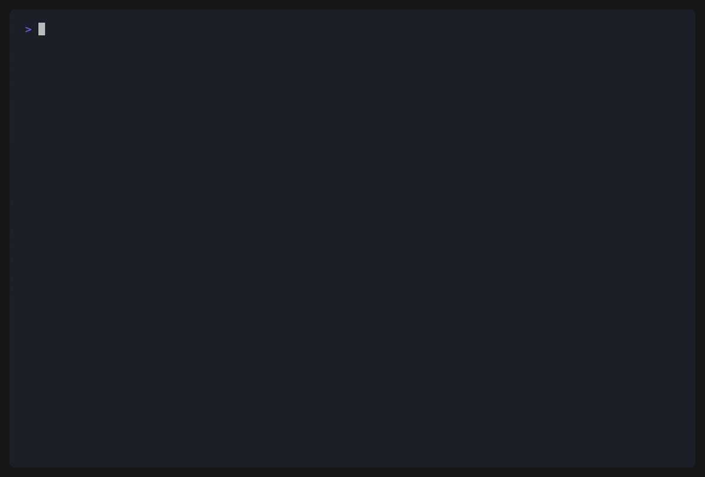

# json_encode for shell

[](https://github.com/fedir/json_encode/actions/workflows/ci.yml)
[](https://goreportcard.com/report/github.com/fedir/json_encode)
[](https://godoc.org/github.com/fedir/json_encode)
[](https://www.gnu.org/licenses/gpl-3.0)

Turn any shell output into JSON — one pipe away.

Built for sysadmins, DevOps and developers who need to feed shell data into APIs,
monitoring systems, ELK, dashboards or `jq` pipelines. It tries to **just work**:
numbers become numbers, whitespace columns split themselves, and output is
pretty-printed and colorized on a terminal but compact when piped.



<sub>Demo recorded with [VHS](https://github.com/charmbracelet/vhs) — regenerate with `make demo` (script: [`demo/demo.tape`](demo/demo.tape)).</sub>

```bash
$ printf 'host db.internal\nport 5432\n' | json_encode -k
{
  "host": "db.internal",
  "port": 5432
}
$ printf 'host db.internal\nport 5432\n' | json_encode -k | cat
{"host":"db.internal","port":5432}
```

## Installation

**Go install** (requires Go 1.16+):

```bash
go install github.com/fedir/json_encode@latest
```

**Homebrew:**

```bash
brew install fedir/tap/json_encode
```

**Pre-built binaries** — grab one for your OS/arch from the
[releases page](https://github.com/fedir/json_encode/releases).

**From source:**

```bash
git clone https://github.com/fedir/json_encode.git
cd json_encode
make build
cp json_encode /usr/local/bin/
```

## Arguments

Every flag has a short and a long form. With no file arguments, input is read from
stdin.

| Flag | Description |
|------|-------------|
| `-c, --columns` | Split each line into fields → **array of arrays** |
| `-n, --names a,b,c` | Split and emit an **array of objects** with these keys |
| `-H, --header` | Split; the **first row supplies the keys** |
| `-k, --kv` | **Object** `{first field: remainder}` |
| `--csv` / `--tsv` | Parse as CSV/TSV (quoted fields honoured); with `-H` → objects |
| `-d, --delimiter STR` | Field separator (default: **runs of whitespace**, awk-style) |
| `-f, --fields LIST` | Keep 1-based fields; supports ranges, e.g. `1-3,7` |
| `-0, --null` | Read NUL-delimited input (`find -print0`) |
| `-p, --pretty` | Force pretty (multi-line) |
| `--compact` | Force compact (single line) |
| `--color MODE` | `auto` (default) / `always` / `never` (also `--no-color`) |
| `--raw` | Keep every value a string (disable type inference) |
| `-l, --jsonl` | Newline-delimited JSON, one value per line |
| `-F, --follow` | Stream line-by-line as input arrives (`tail -f`) |
| `-o, --output FILE` | Write to FILE instead of stdout |
| `--wrap` | Wrap output in `{host, timestamp, data}` |
| `-V, --version` | Print version and exit |
| `-h, --help` | Show help |

**Smart defaults:**

- **Type inference is on.** Values that round-trip exactly become real JSON
  numbers / booleans / `null`; anything ambiguous stays a string, so leading-zero
  IDs (`007`), versions (`1.2.3`), IPs and times are preserved. Use `--raw` to keep
  everything as strings.
- **Splitting defaults to whitespace runs** (awk-style), so `ps`/`df`/`free` output
  needs no `tr -s`. Pass `-d` for a literal delimiter.
- **Output adapts to the terminal:** pretty + color when stdout is a TTY, compact
  and uncolored when piped or redirected. Override with `-p`, `--compact`, `--color`.

**Mode precedence:** `-k` → `-H`/`-n` (objects) → `-c`/`--csv`/`--tsv` (columns) → lines.

## Basic usage

**Lines → JSON array** (numbers are typed)

```bash
seq 1 5 | json_encode
[1,2,3,4,5]
```

**Columns → array of arrays** (`-c`, whitespace split by default)

```bash
echo -e "alice 30\nbob 25" | json_encode -c
[["alice",30],["bob",25]]
```

**Key-value → JSON object** (`-k`)

```bash
echo -e "host db.internal\nport 5432" | json_encode -k
{"host":"db.internal","port":5432}
```

**Named columns → array of objects** (`-n` / `-H`)

```bash
echo -e "alice 30\nbob 25" | json_encode -n name,age
[{"age":30,"name":"alice"},{"age":25,"name":"bob"}]

# or let the data name itself from a header row
ps -eo pid,comm | json_encode -H
[{"COMMAND":"systemd","PID":1},{"COMMAND":"sshd","PID":512},...]
```

**Keep everything as strings** (`--raw`)

```bash
echo -e "id 007\nport 5432" | json_encode -k --raw
{"id":"007","port":"5432"}
```

**Newline-delimited JSON for log shippers** (`-l`)

```bash
echo -e "a\nb\nc" | json_encode -l
"a"
"b"
"c"
```

**Custom delimiter** (`-d`)

```bash
echo -e "a,b,c\nd,e,f" | json_encode -c -d ,
[["a","b","c"],["d","e","f"]]
```

## Upgrading from 2.x

3.0 renames flags for consistency (GNU-style short + long) and turns two former
flags into defaults. Old flag → new flag:

| 2.x | 3.0 |
|-----|-----|
| `-s SEP` | `-d, --delimiter SEP` |
| `-sc` | `-c, --columns` |
| `-cols A,B` | `-n, --names A,B` |
| `-header` | `-H, --header` |
| `-kv` | `-k, --kv` |
| `-w` | *(now the default; use `-d` for a literal delimiter)* |
| `-t` | *(type inference is now on; use `--raw` to disable)* |
| `-nd` | `-l, --jsonl` |
| `-stream` | `-F, --follow` |
| `-o` (wrap) | `--wrap` |
| *(n/a)* | `-o, --output FILE` now writes to a file |
| `-v` / `-version` | `-V, --version` |

## Advanced usage

### Collect failed systemd units for an alert

```bash
systemctl list-units --state=failed --no-legend \
  | awk '{print $1}' \
  | json_encode
["nginx.service","mysql.service"]
```

### Processes as typed objects, no `tr -s` needed

Whitespace splitting and a header row turn `ps` straight into self-describing,
typed records:

```bash
ps -eo pid,comm,pcpu,rss | json_encode -H -l
{"COMMAND":"systemd","PID":1,"%CPU":0,"RSS":12344}
{"COMMAND":"sshd","PID":512,"%CPU":0.1,"RSS":4096}
```

`-l` emits one object per line — ready to pipe into Elasticsearch `_bulk`, Loki,
Vector or Fluent Bit.

### `docker ps` straight to objects — no `jq` needed

```bash
docker ps --format 'table {{.Names}}\t{{.Image}}\t{{.Status}}' \
  | json_encode --tsv -H
[{"IMAGE":"nginx:latest","NAMES":"web","STATUS":"Up 2 hours"},
 {"IMAGE":"redis:7","NAMES":"cache","STATUS":"Up 5 days"}]
```

### Numeric thresholds without `tonumber`

Numbers arrive typed, so `jq` comparisons just work:

```bash
df -h --output=source,pcent | tail -n +2 | tr -d ' %' \
  | json_encode -k \
  | jq -c 'to_entries | map(select(.value > 80)) | map(.key)'
["/dev/sda1","/dev/sdc1"]
```

### Project columns without `cut`

`-f` picks fields (with ranges), and pairs with `-n` to name them:

```bash
# user, uid and shell from /etc/passwd, as named objects
json_encode -d : -f 1,3,7 -n user,uid,shell /etc/passwd
[{"shell":"/bin/bash","uid":0,"user":"root"},...]
```

### Parse a CSV report and query it

File arguments auto-detect `.csv`/`.tsv`, and quoted fields are honoured:

```bash
json_encode -H costs.csv \
  | jq '.[] | select(.service=="EC2") | .cost'
42.50
```

### Map running containers to their image

```bash
docker ps --format '{{.ID}}\t{{.Image}}' | json_encode -k -d $'\t'
{"a1b2c3d4":"nginx:latest","b5c6d7e8":"redis:7"}
```

### Export environment as a JSON object

```bash
env | json_encode -k -d =
{"HOME":"/root","PATH":"/usr/bin:/bin","USER":"root",...}
```

### Git log as structured records

```bash
git log --pretty=format:"%h|%an|%ad|%s" -n 3 | json_encode -c -d "|" -n hash,author,date,subject
[{"author":"Alice","date":"...","hash":"a1b2c3d","subject":"fix: handle timeout"},...]
```

### Inventory files safely with `find -print0`

`-0` reads NUL-delimited input, so paths with spaces or newlines survive intact:

```bash
find /var/log -name '*.log' -print0 | json_encode -0
["/var/log/sys log.1","/var/log/nginx/access.log",...]
```

### Stamp a snapshot with host and timestamp

`--wrap` envelopes the output with `host` and a UTC `timestamp` — a self-contained
audit record. `-o` writes it straight to a file:

```bash
rpm -qa | sort | json_encode --wrap -o /var/audit/packages.json
# {"data":["acl-2.3.1","bash-5.2.15",...],"host":"web01","timestamp":"2026-06-05T08:00:00Z"}
```

### Ship access.log to Loki

Loki's push API expects `{"streams":[{"stream":{labels},"values":[["timestamp_ns","line"],...]}]}`.

**Batch — send the last N lines on a schedule (e.g. from cron):**

```bash
tail -n 500 /var/log/nginx/access.log \
  | json_encode --raw \
  | jq -c --arg job nginx --arg host "$(hostname)" \
      '{streams:[{stream:{job:$job,host:$host},
                  values:[.[] | [(now*1e9|tostring), .]]}]}' \
  | curl -s -X POST http://loki:3100/loki/api/v1/push \
        -H 'Content-Type: application/json' -d @-
```

**Structured — parse fields and attach them as Loki stream labels:**

nginx default log format: `IP - - [date] "METHOD path proto" status bytes`

```bash
tail -n 500 /var/log/nginx/access.log \
  | awk '{print $1"|"$7"|"$9}' \
  | json_encode -c -d '|' --raw \
  | jq -c --arg host "$(hostname)" \
      '[.[] | {ip:.[0], path:.[1], status:.[2]}] |
       {streams:[{stream:{job:"nginx",host:$host},
                  values:[.[] | [(now*1e9|tostring),
                                 ("ip="+.ip+" path="+.path+" status="+.status)]]}]}' \
  | curl -s -X POST http://loki:3100/loki/api/v1/push \
        -H 'Content-Type: application/json' -d @-
```

**Tail in real time — ship each new line as it arrives:**

`-F/--follow` emits one JSON value per line the moment it appears (no `while read`
loop, no waiting for EOF):

```bash
tail -f /var/log/nginx/access.log \
  | json_encode -F -l --raw \
  | while IFS= read -r line; do
      printf '%s' "$line" \
        | jq -c --arg host "$(hostname)" \
            '{streams:[{stream:{job:"nginx",host:$host},
                        values:[[(now*1e9|tostring), .]]}]}' \
        | curl -s -X POST http://loki:3100/loki/api/v1/push \
              -H 'Content-Type: application/json' -d @-
    done
```

## Development

```bash
make build            # compile → ./json_encode
make test             # go test -race ./...
make vet              # go vet ./...
make functional-test  # build + shell-level integration tests (needs jq)
make demo             # regenerate the README GIF (needs vhs + gifsicle)
make snapshot         # local GoReleaser build, no publish
make clean            # remove build artifacts
```

Pure standard library, no runtime dependencies.
